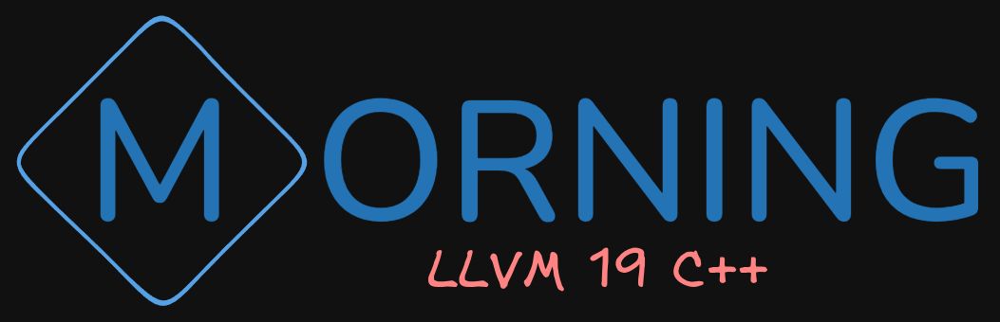

# ⚙️ morning.lang
 

  
  

  Aesthetic programming language in C++ (llvm)
     
    <a href="https://alexeev-prog.github.io/morning.lang/"><strong>Explore the docs »</strong></a>
     
     
    <a href="https://alexeev-prog.github.io/morning.lang/">Documentation</a>
    ·
    <a href="https://github.com/alexeev-prog/morning.lang/blob/main/LICENSE">License</a>
  

 

    
    
    
    
    
    
    

    
    

    

 > [!CAUTION]
 > At the moment, morning.lang is under active development, many things may not work, and this version is not recommended for use (all at your own risk)

 > [!NOTE]
 > Building and installion: See the [BUILDING](BUILDING.md) document.

 > [!NOTE]
 > Contributing: See the [CONTRIBUTING](CONTRIBUTING.md) document.

 > [!NOTE]
 > Licensing: [GNU GPL V3](./LICENSE)
