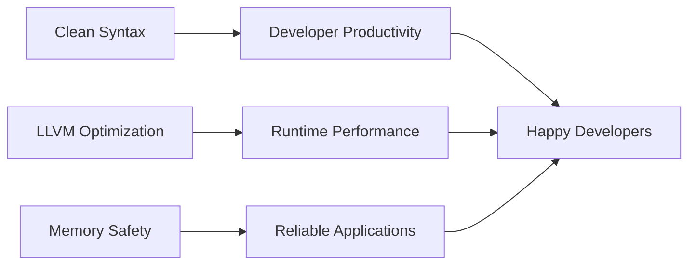

# ⚡ morning.lang - The Next-Gen Systems Programming Language
<a id="readme-top"></a>

<div align="center">
  

  <h3>A high-performance language combining C++ power with LLVM19 optimization</h3>

  <div>
    <a href="https://alexeev-prog.github.io/morning.lang/">
      
    </a>
    <a href="https://github.com/alexeev-prog/morning.lang/blob/main/LICENSE">
      
    </a>
    <a href="https://github.com/alexeev-prog/morning.lang/stargazers">
      
    </a>
  </div>
</div>

<br>

<div align="center">
  
  
  
  
  
  
</div>

<div align="center" style="margin: 15px 0">
  
  
</div>

<div align="center">
  
</div>

## Usage

```
Usage: morningllvm [options]

Options:
    -e, --expression  Expression to parse
    -f, --file        File to parse
    -o, --output      Output binary name
```

## Example

```
[func square (x) (* x x)]

[func scoped_function (x) [scope
    [+ x 100]
    [while (> x 0)
        [scope
            [set x (- x 1)]
            [fprint "%d " x]]]
    ]
    [fprint "\n"]
]

[fprint "square 10: %d\n" (square 10)]
[fprint "square 0xA: %d\n" (square 0xA)]
[fprint "square 012: %d\n" (square 012)]
[fprint "square 0b1010: %d\n" (square 0b1010)]

[fprint "scoped_function 10: %d\n" (scoped_function 10)]

[var (a !int) 10]

[fprint "a: %d\n" a]

[check (== a 10)
    [set a 0]]

[fprint "a: %d\n" a]

[func sum ((first !int) (second !int)) -> !int (+ first second)]

[fprint "sum 100 1: %d\n\n" (sum 100 1)]
```

---

Read our [SHORT GUIDELINES](./SHORT_GUIDELINES.md)

## Powering Performance with Modern Tech
Morning.lang combines the raw power of C++ with the cutting-edge optimization capabilities of **LLVM 19** to deliver exceptional performance:

- ⚡️ **LLVM19 Backend**: Leverages the latest optimizations from the LLVM project
- 🚀 **Near-Native Speed**: Compiles to highly optimized machine code
- 🔧 **Modern C++17**: Built with contemporary C++ features and best practices
- 🧠 **Smart Memory Management**: Automatic scope-based resource handling
- 🌉 **Seamless Interop**: Easily integrate with existing C/C++ libraries

## Why Developers Love Morning.lang


### Key Advantages Over Traditional Languages
| Feature                | Benefit                                                                 |
|------------------------|-------------------------------------------------------------------------|
| ⚡ **LLVM19-Powered**  | Access to latest compiler optimizations and CPU features                |
| 🎨 **Expressive Syntax** | Write complex operations with minimal boilerplate                      |
| 🧩 **Modular Design**  | Extend with custom optimizers and language features                    |
| 🌐 **Cross-Platform**  | Single codebase compiles to Windows, Linux, macOS binaries             |
| 🔒 **Memory Safety**   | Scope-based ownership eliminates common memory errors                  |
| 🔄 **Metaprogramming** | Powerful compile-time code generation capabilities                     |

---

## ⚠️ Important Notes

> [!CAUTION]
> **Active Development Notice**
> Morning.lang is currently under active development. While core features are stable, some advanced capabilities are still being perfected. We welcome early adopters to help shape the language!

> [!NOTE]
> **Building & Installation**
> See the [BUILDING GUIDE](BUILDING.md) for detailed instructions on compiling from source.

> [!NOTE]
> **Want to Contribute?**
> Check out our [CONTRIBUTING GUIDELINES](CONTRIBUTING.md). We especially welcome LLVM and compiler experts!

> [!NOTE]
> **License**
> Morning.lang is licensed under [GNU GPL V3](./LICENSE) - Free to use, modify, and distribute

<!--
### 4. Seamless C/C++ Integration

```morning
// Easily call C functions
[extern "libm" sin (x !double) -> !double]

[func calculate (angle)
    (sin (* angle (/ 3.14159 180.0)))]
``` -->

---

## 💡 Language Highlights

### 🧩 Example

```morning
[var [ALPHA !int] 42]

[scope
    [var [ALPHA !string] "Hello"]
    [fprint "ALPHA: %s\n" ALPHA]]

[fprint "ALPHA: %d\n" ALPHA]

[set ALPHA 100]

[fprint "ALPHA: %d\n" ALPHA]

[fprint "_VERSION: %d\n\n" _VERSION] // _VERSION is reserved global var
```

### 🧩 Functions
```morning
[func square (x) (* x x)]

[fprint "square 10: %d\n" (square 10)]

[func sum ((first !int) (second !int)) <-> !int (+ first second)]

[fprint "sum 100 1: %d\n\n" (sum 100 1)]
```

## 🧩 Number systems
```morning
[func square (x) (* x x)]

[fprint "square 10: %d\n" (square 10)]
[fprint "square 0xA: %d\n" (square 0xA)]
[fprint "square 012: %d\n" (square 012)]
[fprint "square 0b1010: %d\n" (square 0b1010)]

[func sum ((first !int) (second !int)) -> !int (+ first second)]

[fprint "sum 100 1: %d\n\n" (sum 100 1)]
```

## 🧩 While Loop
```morning
[var a 10]

[while (> a 0)
    [scope
        [set a (- a 1)]
        [fprint "%d " a]]]

[fprint "\nA: %d\n\n" a]
```

## 🧩 Check (if-then-else) conditions
```morning
[var b 100]

[var a (+ b 1)]

[check (== a 101)
    [check (> a 100)
        [set a 1000]
        [set a -1]]
    [set a 0]]

[fprint "A: %d\n\n" a]
```

<!--
### 🔁 Concurrency Support
```morning
// Lightweight coroutines
[coroutine data_producer ()
    [loop
        [var data (fetch_data)]
        [yield data]]]

// Parallel execution
[parallel
    [task process_data data]
    [task log_metrics]]
``` -->

---

## 📚 Documentation & Learning Resources

Explore comprehensive documentation at:
[https://alexeev-prog.github.io/morning.lang/](https://alexeev-prog.github.io/morning.lang/)

### Learning Path:
1. **Language Tour**: Quick overview of syntax and features
2. **LLVM Integration**: How Morning.lang leverages LLVM internals
3. **Performance Guide**: Optimization techniques and benchmarks
4. **C++ Interop**: Working with existing C/C++ libraries
5. **Compiler Development**: Contributing to the language core

---

## 💻 Getting Started in 5 Minutes

### 1. Build from Source
```bash
# Clone repository (requires LLVM 19 development files)
git clone --recurse-submodules https://github.com/alexeev-prog/morning.lang.git
cd morning.lang

# build
./build.sh all
```

---

## 🏗️ Real-World Applications

Morning.lang excels in:
- **High-performance computing**
- **System utilities development**
- **Game engines**
- **Blockchain infrastructure**
- **Compiler development**
- **Embedded systems programming**
<!--


<div align="center">
  <br>
  <a href="#readme-top">↑ Back to Top ↑</a>
  <br>
  <sub>Built with ❤️ and LLVM 19</sub>
</div>
