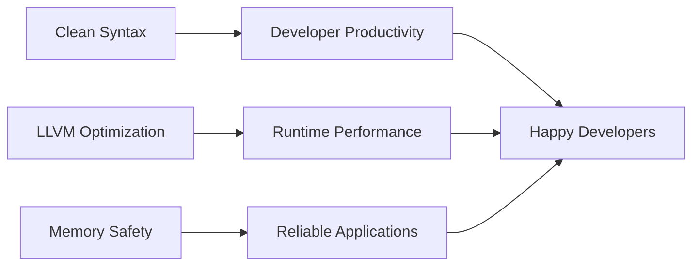

# ⚡ morning.lang - The Next-Gen Systems Programming Language
<a id="readme-top"></a>

<div align="center">
  

  <h3>A high-performance language combining C++ power with LLVM19 optimization</h3>

  <div>
    <a href="https://marketplace.visualstudio.com/items?itemName=alexeevdev.morning-language-syntax">
      
    </a>
    <a href="https://github.com/alexeev-prog/morning.lang/blob/main/LICENSE">
      
    </a>
    <a href="https://github.com/alexeev-prog/morning.lang/stargazers">
      
    </a>
  </div>
</div>

<br>

<div align="center">
  
  
  
  
  
  
</div>

<div align="center" style="margin: 15px 0">
  
  
</div>

<div align="center">
  
</div>

## VSCode Extension
We have VS Code extension for code highlight and snippets. [Extension here](https://marketplace.visualstudio.com/items?itemName=alexeevdev.morning-language-syntax).


## Standards
For see Morning Standards, see [morning-standards](https://github.com/alexeev-prog/morning-standards).

Last standards:

 + MCG-2 (Morning Coding Guidelines 2). [Read here](https://github.com/alexeev-prog/morning-standards/blob/main/standards/MCG2/index.md).
 + MCG-1 (Morning Coding Guidelines 1). [Read here](https://github.com/alexeev-prog/morning-standards/blob/main/standards/MCG1/index.md).

## Usage

```
Usage: morninglang [options]

MorningLLVM - Compiler for the Morning programming language

Options:
  -h, --help                     Print this help message
  -e, --expression <expr>        Expression to parse
  -f, --file <file>              File to parse
  --lint <file>                  File to lint
  -o, --output <name>            Output binary name
  -k, --keep                     Keep temporary files
```

## Example

```
[func square (x) (* x x)]

[func scoped_function (x) [scope
    [+ x 100]
    [while (> x 0)
        [scope
            [set x (- x 1)]
            [fprint "%d " x]]]
    ]
    [fprint "\n"]
]

[fprint "square 10: %d\n" (square 10)]
[fprint "square 0xA: %d\n" (square 0xA)]
[fprint "square 012: %d\n" (square 012)]
[fprint "square 0b1010: %d\n" (square 0b1010)]

[fprint "scoped_function 10: %d\n" (scoped_function 10)]

[var (a !int) 10]

[fprint "a: %d\n" a]

[check (== a 10)
    [set a 0]]

[fprint "a: %d\n" a]

[func sum ((first !int) (second !int)) -> !int (+ first second)]

[fprint "sum 100 1: %d\n\n" (sum 100 1)]
```

## Powering Performance with Modern Tech
Morning.lang combines the raw power of C++ with the cutting-edge optimization capabilities of **LLVM 19** to deliver exceptional performance:

- ⚡️ **LLVM19 Backend**: Leverages the latest optimizations from the LLVM project
- 🚀 **Near-Native Speed**: Compiles to highly optimized machine code
- 🔧 **Modern C++17**: Built with contemporary C++ features and best practices
- 🧠 **Smart Memory Management**: Automatic scope-based resource handling
- 🌉 **Seamless Interop**: Easily integrate with existing C/C++ libraries

## Why Developers Love Morning.lang


### Key Advantages Over Traditional Languages
| Feature                | Benefit                                                                 |
|------------------------|-------------------------------------------------------------------------|
| ⚡ **LLVM19-Powered**  | Access to latest compiler optimizations and CPU features                |
| 🎨 **Expressive Syntax** | Write complex operations with minimal boilerplate                      |
| 🧩 **Modular Design**  | Extend with custom optimizers and language features                    |
| 🌐 **Cross-Platform**  | Single codebase compiles to Windows, Linux, macOS binaries             |
| 🔒 **Memory Safety**   | Scope-based ownership eliminates common memory errors                  |
| 🔄 **Metaprogramming** | Powerful compile-time code generation capabilities                     |

---

## ⚠️ Important Notes

> [!CAUTION]
> **Active Development Notice**
> Morning.lang is currently under active development. While core features are stable, some advanced capabilities are still being perfected. We welcome early adopters to help shape the language!

> [!NOTE]
> **Building & Installation**
> See the [BUILDING GUIDE](BUILDING.md) for detailed instructions on compiling from source.

> [!NOTE]
> **Want to Contribute?**
> Check out our [CONTRIBUTING GUIDELINES](CONTRIBUTING.md). We especially welcome LLVM and compiler experts!

> [!NOTE]
> **License**
> Morning.lang is licensed under [GNU GPL V3](./LICENSE) - Free to use, modify, and distribute

<!--
### 4. Seamless C/C++ Integration

```morning
// Easily call C functions
[extern "libm" sin (x !double) -> !double]

[func calculate (angle)
    (sin (* angle (/ 3.14159 180.0)))]
``` -->

---

## 💡 Language Highlights

### 🧩 Low Level
```morning
// Allocate memory for an integer and store pointer in 'ptr'
[var (ptr !ptr) (mem-alloc (sizeof !int))]
[fprint "Memory allocated at: %p\n" ptr]

// Write value to allocated memory
[mem-write ptr 42]
[fprint "Value written: %d\n" 42]

// Read value back from memory
[var (value !int) (mem-read ptr !int)]
[fprint "Value read: %d\n" value]

// Pointer operations
[var (x !int) 100]
[var (x_ptr !ptr) (mem-ptr x)] // Get address of variable 'x'
[fprint "Address of x: %p\n" x_ptr]

// Dereference pointer
[var (x_val !int) (mem-deref x_ptr !int)]
[fprint "Value of x via pointer: %d\n" x_val]

// Modify value through pointer
[mem-write x_ptr 200]
[fprint "New value of x: %d\n" x]

// Free allocated memory
[mem-free ptr]
[fprint "Memory freed\n"]

// Bit manipulation
[var (flags !int) 0]
[set flags (bit-or flags 0b1010)]  // Set bits (bitwise OR)
[fprint "Flags: %b\n" flags]

// Bit check
//[check (bit-and flags 0b0010)
//    [fprint "Bit 2 is set!\n"]
//    [fprint "Bit 2 is not set!\n"]]

// Raw byte operations
[var (buffer !ptr) (mem-alloc 4)] // Allocate 4-byte buffer
[byte-write buffer 0x41]     // Write 'A' (ASCII 0x41)

// Read bytes
[fprint "Byte 0: %c\n" (byte-read buffer)]

// Size-constrained type declaration
[var (size_checked_int !size:8!int) 0] // 8-bit integer
```

### 🧩 Arrays
```morning
[var (arr !array<!int,3>) (array 1 2 3)]

// Access element
[fprint "Element 0: %d\n" (index arr 0)]

// Modify element
[set (index arr 0) 10]
[var idx 0]
[fprint "Modified element 0: %d\n" (index arr idx)]
```

### 🧩 Factorial
```morning
[func factorial (x) (scope
	(check (== x 0)
        1
        (* x (factorial (- x 1)))
    )
)]

(fprint "Factorial of 5: %d\n" (factorial 5))
```

### For loops
```morning
(var sum 0)
(for (var i 1) (<= i 10) (set i (+ i 1))
    (scope
    	(fprint "Result: %d\n" i)
        (check (>= i 5)
            (break)
        )
    )
)
(fprint "Result: %d\n" sum)
```

### 🧩 Functions
```morning
[func square (x) (* x x)]

[fprint "square 10: %d\n" (square 10)]

[func sum ((first !int) (second !int)) <-> !int (+ first second)]

[fprint "sum 100 1: %d\n\n" (sum 100 1)]
```

## 🧩 Number systems
```morning
[func square (x) (* x x)]

[fprint "square 10: %d\n" (square 10)]
[fprint "square 0xA: %d\n" (square 0xA)]
[fprint "square 012: %d\n" (square 012)]
[fprint "square 0b1010: %d\n" (square 0b1010)]

[func sum ((first !int) (second !int)) -> !int (+ first second)]

[fprint "sum 100 1: %d\n\n" (sum 100 1)]
```

## 🧩 While Loop
```morning
(var x 1)
(while (> x 0)
    (scope
        (fprint "x = %d\n" x)
        (check (== x 1)
            [scope
                [fprint "continue\n"]
                [set x (+ x 1)]
                (continue)
                (continue)
            ]
        )
        (set x (+ x 1))
        (check (== x 5)
            (break)
        )
    )
)
(fprint "x = %d\n" x)
```

## 🧩 Loops
```morning
[var counter 0]
[loop
    [scope
        [set counter (+ counter 1)]
        [fprint "Счетчик: %d\n" counter]
        [check (== counter 5)
            [break]
            []
        ]
    ]
]
```

## 🧩 if-elif-else
```morning
[var x 11]
(if
    (> x 10)       (fprint "x > 10")  // if branch
    elif (> x 5)   (fprint "x > 5")   // elif branch
    else           (fprint "x <= 5")  // else branch
)
```

## 🧩 fcasn & fprint
```morning
(var height 0)

(fprint "Enter height: ")
(finput "%d" height)
(fprint "%d\n" height)
```

## 🧩 For Loop
```morning
[for (var i 0) (< i 6) (set i (+ i 1))
    [scope
        (fprint "Value: %d\n" i)
        [check (== i 3)
              (break)
          ]
    ]
]
```

## 🧩 Check (if-then-else) conditions
```morning
[var b 100]

[var a (+ b 1)]

[check (== a 101)
    [check (> a 100)
        [set a 1000]
        [set a -1]]
    [set a 0]]

[fprint "A: %d\n\n" a]
```

<!--
### 🔁 Concurrency Support
```morning
// Lightweight coroutines
[coroutine data_producer ()
    [loop
        [var data (fetch_data)]
        [yield data]]]

// Parallel execution
[parallel
    [task process_data data]
    [task log_metrics]]
``` -->

---

## 📚 Documentation & Learning Resources

Explore comprehensive documentation at:
[https://alexeev-prog.github.io/morning.lang/](https://alexeev-prog.github.io/morning.lang/)

### Learning Path:
1. **Language Tour**: Quick overview of syntax and features
2. **LLVM Integration**: How Morning.lang leverages LLVM internals
3. **Performance Guide**: Optimization techniques and benchmarks
4. **C++ Interop**: Working with existing C/C++ libraries
5. **Compiler Development**: Contributing to the language core

---

## 💻 Getting Started in 5 Minutes

### 1. Build from Source
```bash
# Clone repository (requires LLVM 19 development files)
git clone --recurse-submodules https://github.com/alexeev-prog/morning.lang.git
cd morning.lang

# build
./build.sh all
```

---

## 🏗️ Real-World Applications

Morning.lang excels in:
- **High-performance computing**
- **System utilities development**
- **Game engines**
- **Blockchain infrastructure**
- **Compiler development**
- **Embedded systems programming**
<!--


<div align="center">
  <br>
  <a href="#readme-top">↑ Back to Top ↑</a>
  <br>
  <sub>Built with ❤️ and LLVM 19</sub>
</div>
