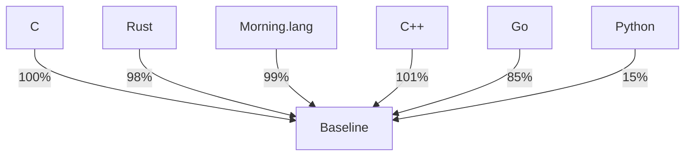
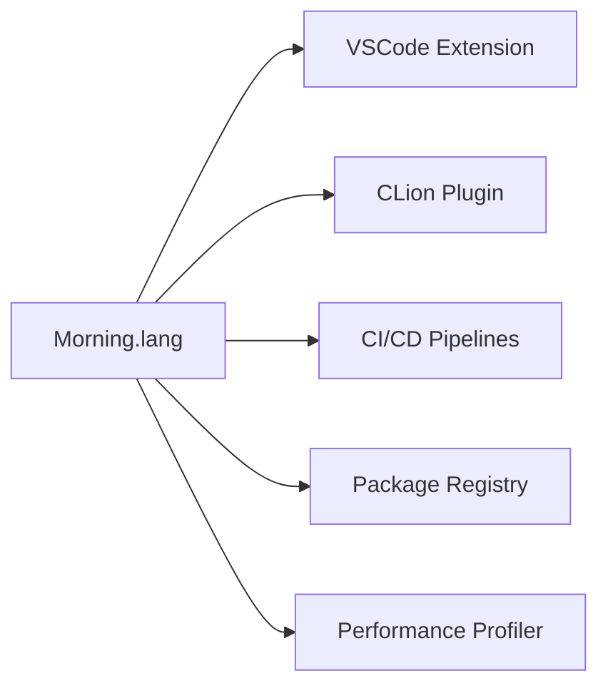

# ⚡ morning.lang - The Next-Gen Systems Programming Language  
<a id="readme-top"></a>  

<div align="center">  
    

  <h3>A high-performance systems language combining C++ power with LLVM19 optimization</h3>  

  <div>  
    <a href="https://marketplace.visualstudio.com/items?itemName=alexeevdev.morning-language-syntax">  
        
    </a>  
    <a href="https://github.com/alexeev-prog/morning.lang/blob/main/LICENSE">  
        
    </a>  
    <a href="https://github.com/alexeev-prog/morning.lang/stargazers">  
        
    </a>  
  </div>  
</div>  

<br>  

<div align="center">  
    
    
    
    
    
    
</div>  

<div align="center" style="margin: 15px 0">  
    
    
</div>  

<div align="center">  
    
</div>  

## 🚀 Technical Overview  
Morning.lang is a statically-typed systems programming language designed for performance-critical applications.  
Built on LLVM 19, it combines low-level memory control with expressive S-expression syntax.  

### Core Technical Features  
| Feature | Technical Implementation | Performance Impact |  
|---------|---------------------------|---------------------|  
| **S-expression Syntax** | Lisp-inspired uniform code representation | Reduced cognitive load, enhanced metaprogramming |  
| **LLVM19 Backend** | Direct LLVM IR generation via C++ API | Near-native execution speed, advanced optimizations |  
| **Static Typing System** | Type annotations (!int, !ptr) with inference | Compile-time safety, zero-cost abstractions |  
| **Memory Control** | Manual allocation (mem-alloc) with scope-based safety | Predictable performance, no GC pauses |  
| **Bitwise Operations** | Native bit-and/bit-or/bit-shl instructions | Hardware-level efficiency |  
| **Cross-Platform** | Single IR → Windows/Linux/macOS binaries | Consistent behavior across platforms |  

### Performance Benchmarks  


*Comparative execution speed vs C baseline (higher is better)*  

## ⚙️ Language Components  

### Primitive Types  
| Type | Size | Description | Example |  
|------|------|-------------|---------|  
| **!int** | 64-bit | Default integer type | `[var (counter !int) 0]` |  
| **!frac** | 64-bit | IEEE 754 floating point | `[var (pi !frac) 3.14159]` |  
| **!bool** | 1-byte | Boolean value | `[var (flag !bool) true]` |  
| **!str** | ptr + size | UTF-8 string | `[var (name !str) "Alice"]` |  
| **!ptr** | arch-dependent | Raw memory pointer | `[var (buffer !ptr) (mem-alloc 256)]` |  
| **!none** | 0-byte | Void type | `[func noop () -> !none]` |  

### Memory Operations  
| Operation | Syntax | Description |  
|-----------|--------|-------------|  
| **Allocation** | `[mem-alloc size]` | Allocate raw memory block |  
| **Deallocation** | `[mem-free ptr]` | Release allocated memory |  
| **Memory Read** | `[mem-read ptr type]` | Read typed value from address |  
| **Memory Write** | `[mem-write ptr value]` | Write value to memory location |  
| **Address Of** | `[mem-ptr variable]` | Get address of variable |  
| **Dereference** | `[mem-deref ptr type]` | Access value through pointer |  

### Control Flow Constructs  
```morning  
// Conditional execution  
[if (> x 10)  
    (fprint "High value")  
  elif (> x 5)  
    (fprint "Medium value")  
  else  
    (fprint "Low value")]  

// Loop constructs  
[while (> x 0)  
    (set x (- x 1))]  

[for (var i 0) (< i 10) (set i (+ i 1))  
    (fprint "Iteration: %d" i)]  

// Ternary operator  
[var result (check (> x 0) "Positive" "Non-positive")]  
```  

## 📦 Installation & Usage  

### System Requirements  
- LLVM 19 development files  
- C++20 compatible compiler  
- 4GB RAM minimum (8GB recommended)  
- 2GB disk space  

### Build Instructions  
```bash  
# Clone repository with submodules  
git clone --recurse-submodules https://github.com/alexeev-prog/morning.lang.git  
cd morning.lang  

# Configure build  
./configure --llvm-path=/path/to/llvm19  

# Compile  
make -j$(nproc)  

# Install system-wide  
sudo make install  
```  

### Command Line Interface  
```  
Usage: morninglang [options]  

MorningLLVM - Compiler for the Morning programming language  

Options:  
  -h, --help                     Print this help message  
  -e, --expression <expr>        Execute single expression  
  -f, --file <file>              Compile source file  
  -l, --lint <file>              Analyze code quality  
  -o, --output <name>            Output binary name  
  -k, --keep                     Retain intermediate files  
  -O0/-O1/-O2/-O3                Optimization level  
  --emit-llvm                    Output LLVM IR instead of binary  
```  

## 💡 Language Highlights

### 🧩 Low Level
```morning
// Allocate memory for an integer and store pointer in 'ptr'
[var (ptr !ptr) (mem-alloc (sizeof !int))]
[fprint "Memory allocated at: %p\n" ptr]

// Write value to allocated memory
[mem-write ptr 42]
[fprint "Value written: %d\n" 42]

// Read value back from memory
[var (value !int) (mem-read ptr !int)]
[fprint "Value read: %d\n" value]

// Pointer operations
[var (x !int) 100]
[var (x_ptr !ptr) (mem-ptr x)] // Get address of variable 'x'
[fprint "Address of x: %p\n" x_ptr]

// Dereference pointer
[var (x_val !int) (mem-deref x_ptr !int)]
[fprint "Value of x via pointer: %d\n" x_val]

// Modify value through pointer
[mem-write x_ptr 200]
[fprint "New value of x: %d\n" x]

// Free allocated memory
[mem-free ptr]
[fprint "Memory freed\n"]

// Raw byte operations
[var (buffer !ptr) (mem-alloc 4)] // Allocate 4-byte buffer
[byte-write buffer 0x41]     // Write 'A' (ASCII 0x41)

// Read bytes
[fprint "Byte 0: %c\n" (byte-read buffer)]

// Size-constrained type declaration
[var (size_checked_int !size:8!int) 0] // 8-bit integer
```

### 🧩 Input strings
```morning
[var (name !str) "Initial"]

[fprint "Enter your name: "]
[finput "%[^\n]" name]

[fprint "Hello, %s!\n" name]
```

### 🧩 Arrays
```morning
[var (arr !array<!int,3>) (array 1 2 3)]

// Access element
[fprint "Element 0: %d\n" (index arr 0)]

// Modify element
[set (index arr 0) 10]
[var idx 0]
[fprint "Modified element 0: %d\n" (index arr idx)]
```

### 🧩 Factorial
```morning
[func factorial (x) (scope
	(check (== x 0)
        1
        (* x (factorial (- x 1)))
    )
)]

(fprint "Factorial of 5: %d\n" (factorial 5))
```

### For loops
```morning
(var sum 0)
(for (var i 1) (<= i 10) (set i (+ i 1))
    (scope
    	(fprint "Result: %d\n" i)
        (check (>= i 5)
            (break)
        )
    )
)
(fprint "Result: %d\n" sum)
```

### 🧩 Functions
```morning
[func square (x) (* x x)]

[fprint "square 10: %d\n" (square 10)]

[func sum ((first !int) (second !int)) <-> !int (+ first second)]

[fprint "sum 100 1: %d\n\n" (sum 100 1)]
```

## 🧩 Number systems
```morning
[func square (x) (* x x)]

[fprint "square 10: %d\n" (square 10)]
[fprint "square 0xA: %d\n" (square 0xA)]
[fprint "square 012: %d\n" (square 012)]
[fprint "square 0b1010: %d\n" (square 0b1010)]

[func sum ((first !int) (second !int)) -> !int (+ first second)]

[fprint "sum 100 1: %d\n\n" (sum 100 1)]
```

## 🧩 While Loop
```morning
(var x 1)
(while (> x 0)
    (scope
        (fprint "x = %d\n" x)
        (check (== x 1)
            [scope
                [fprint "continue\n"]
                [set x (+ x 1)]
                (continue)
                (continue)
            ]
        )
        (set x (+ x 1))
        (check (== x 5)
            (break)
        )
    )
)
(fprint "x = %d\n" x)
```

## 🧩 Loops
```morning
[var counter 0]
[loop
    [scope
        [set counter (+ counter 1)]
        [fprint "Счетчик: %d\n" counter]
        [check (== counter 5)
            [break]
            []
        ]
    ]
]
```

## 🧩 if-elif-else
```morning
[var x 11]
(if
    (> x 10)       (fprint "x > 10")  // if branch
    elif (> x 5)   (fprint "x > 5")   // elif branch
    else           (fprint "x <= 5")  // else branch
)
```

## 🧩 fcasn & fprint
```morning
(var height 0)

(fprint "Enter height: ")
(finput "%d" height)
(fprint "%d\n" height)
```

## 🧩 For Loop
```morning
[for (var i 0) (< i 6) (set i (+ i 1))
    [scope
        (fprint "Value: %d\n" i)
        [check (== i 3)
              (break)
          ]
    ]
]
```

## 🧩 Check (if-then-else) conditions
```morning
[var b 100]

[var a (+ b 1)]

[check (== a 101)
    [check (> a 100)
        [set a 1000]
        [set a -1]]
    [set a 0]]

[fprint "A: %d\n\n" a]
```

## 📚 Documentation & Resources  

### Official References  
- [Language Specification (PDF)](https://alexeev-prog.github.io/morning.lang/spec.pdf)  
- [Standard Library API](https://alexeev-prog.github.io/morning.lang/stdlib)  
- [LLVM Integration Guide](https://alexeev-prog.github.io/morning.lang/llvm-integration)  

### Learning Path  
1. **Language Essentials** - Syntax, types, control flow  
2. **Memory Management** - Allocation strategies, safety  
3. **Systems Programming** - Hardware interaction, low-level ops  
4. **Concurrency Models** - Parallel execution, synchronization  
5. **Performance Tuning** - Optimization techniques, profiling  

## 🌐 Community & Contribution  

### Development Ecosystem  


### Contribution Guidelines  
1. **Issue Tracking** - Report bugs via GitHub Issues  
2. **Pull Requests** - Follow [CONTRIBUTING.md](CONTRIBUTING.md)  
3. **Code Standards** - Adhere to MCG-1 specification  
4. **Performance** - Validate changes with benchmarks  
5. **Documentation** - Update relevant documentation  

## ⚖️ License  
```text  
Aesthetic programming language in C++ (llvm)  
Copyright (C) 2025 Alexeev Bronislav  

This program is free software: you can redistribute it and/or modify  
it under the terms of the GNU General Public License as published by  
the Free Software Foundation, either version 3 of the License, or  
(at your option) any later version.  

This program is distributed in the hope that it will be useful,  
but WITHOUT ANY WARRANTY; without even the implied warranty of  
MERCHANTABILITY or FITNESS FOR A PARTICULAR PURPOSE. See the  
GNU General Public License for more details.  

You should have received a copy of the GNU General Public License  
along with this program. If not, see <https://www.gnu.org/licenses/>.  
```  

<div align="center">  
  <br>  
  <a href="#readme-top">↑ Back to Top ↑</a>  
  <br>  
  <sub>Made with LLVM 19</sub>  
</div>
