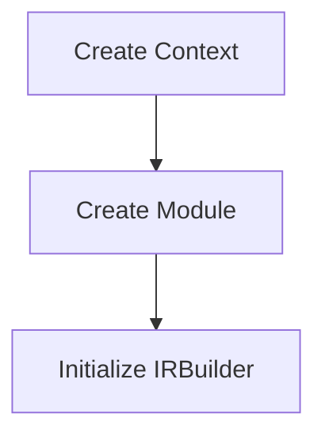
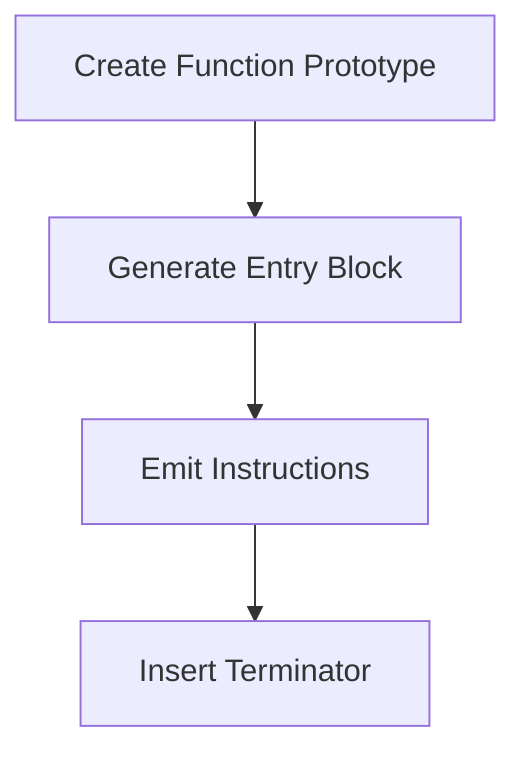
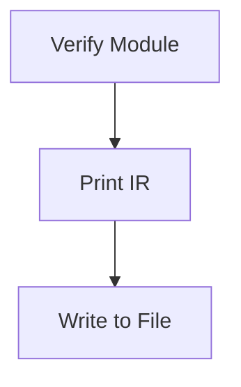

# MorningLang LLVM Code Generator - Professional Documentation

This document provides exhaustive technical documentation for the MorningLang LLVM backend implementation.  
Designed for compiler engineers and C++ developers working with LLVM infrastructure.

---

## Table of Contents
1. [Architectural Overview](#overview)
2. [Core Component Analysis](#components)
3. [Detailed Code Explanation](#code)
4. [LLVM Infrastructure Deep Dive](#llvm)
5. [C++ Implementation Details](#cpp)
6. [Compilation Process Walkthrough](#process)

---

<a name="overview"></a>
## 1. Architectural Overview 🏗️

The system implements a minimal LLVM-based compiler backend with following pipeline:

```
Source → AST (Future) → IR Generation → LLVM IR → Object Code
```

Current implementation focuses on:
- LLVM Context initialization
- IR generation infrastructure
- Module management
- Basic block construction

---

<a name="components"></a>
## 2. Core Component Analysis 🔍

### 2.1 Class Structure

```cpp
class MorningLanguageLLVM {
    // LLVM Context Manager
    std::unique_ptr<llvm::LLVMContext> context;
    
    // IR Container
    std::unique_ptr<llvm::Module> module;
    
    // Instruction Generator
    std::unique_ptr<llvm::IRBuilder<>> irBuilder;
    
    // Current Function Handle
    llvm::Function* activeFunction;
};
```

### 2.2 Component Roles

| Component              | LLVM Class            | Responsibility                          | Lifetime       |
|------------------------|-----------------------|-----------------------------------------|----------------|
| Context Manager         | LLVMContext          | Type/Constant uniquing                  | Whole process  |
| IR Container            | Module               | Function/Global storage                 | Compilation    |
| Instruction Generator   | IRBuilder<>          | SSA-value creation                      | Per-function   |
| Function Handle         | Function             | Current unit of codegen                 | Generation     |

---

<a name="code"></a>
## 3. Detailed Code Explanation 💻

### 3.1 Module Initialization

```cpp
void initializeModule() {
    // 1. Create isolated context for type safety
    //    - Required before any LLVM object creation
    //    - Prevents type conflicts between modules
    context = std::make_unique<llvm::LLVMContext>();
    
    // 2. Initialize compilation unit
    //    - "MorningLangCompilationUnit" = module name
    //    - *context = ownership reference
    module = std::make_unique<llvm::Module>(
        "MorningLangCompilationUnit", 
        *context
    );
    
    // 3. Prepare IR builder
    //    - Requires context for type creation
    //    - Insertion point set later
    irBuilder = std::make_unique<llvm::IRBuilder<>>(*context);
}
```

### 3.2 Function Creation Workflow

```cpp
llvm::Function* createFunction(const std::string& name,
                               llvm::FunctionType* type) {
    // Check existing declarations
    // - Module maintains function symbol table
    if (auto* existing = module->getFunction(name))
        return existing;
    
    // Create function prototype
    // - ExternalLinkage: Visible across modules
    // - verifyFunction: IR validation
    auto* func = llvm::Function::Create(
        type,
        llvm::Function::ExternalLinkage,
        name,
        module.get()
    );
    verifyFunction(*func);
    
    // Prepare function body
    // - Entry block creation
    // - Builder positioning
    auto* entry = llvm::BasicBlock::Create(*context, "entry", func);
    irBuilder->SetInsertPoint(entry);
    
    return func;
}
```

### 3.3 IR Generation Process

```cpp
void generateIR() {
    // 1. Create function type
    //    - getInt32Ty(): 32-bit integer type
    //    - false: Non-variadic function
    auto* mainType = llvm::FunctionType::get(
        irBuilder->getInt32Ty(), 
        /* params */ {}, 
        /* isVarArg */ false
    );
    
    // 2. Function declaration
    activeFunction = createFunction("main", mainType);
    
    // 3. Value generation
    //    - getInt32() creates ConstantInt
    //    - Implicit SSA value
    llvm::Value* result = irBuilder->getInt32(42);
    
    // 4. Terminator instruction
    //    - Required for basic block completion
    irBuilder->CreateRet(result);
}
```

---

<a name="llvm"></a>
## 4. LLVM Infrastructure Deep Dive 🧠

### 4.1 LLVMContext

**Purpose**: Type/constant uniquing and thread isolation  
**Critical Operations**:
```cpp
// Type creation example
llvm::Type* int32Ty = llvm::Type::getInt32Ty(*context);
```

### 4.2 IRBuilder

**Key Features**:
- SSA value management
- Instruction insertion
- Type conversion helpers

**Instruction Creation**:
```cpp
// Typical arithmetic operation
llvm::Value* add = irBuilder->CreateAdd(
    irBuilder->getInt32(40),
    irBuilder->getInt32(2),
    "sum"
);
```

### 4.3 Module

**Structure**:
```llvm
; ModuleID = 'MorningLangCompilationUnit'
source_filename = "MorningLangCompilationUnit"

define i32 @main() {
entry:
  ret i32 42
}
```

---

<a name="cpp"></a>
## 5. C++ Implementation Details ⚙️

### 5.1 Smart Pointers

```cpp
std::unique_ptr<llvm::LLVMContext> context;
```
- **Ownership**: Exclusive ownership model
- **Benefits**:
  - Automatic resource release
  - Clear ownership semantics
  - Exception safety

### 5.2 Modern Type Handling

```cpp
auto* func = module->getFunction(name);
```
- **`auto` Usage**:
  - Type safety with compiler inference
  - Reduces verbosity with complex LLVM types

### 5.3 LLVM Exceptions

```cpp
verifyFunction(*func);
```
- **Validation**:
  - Basic block integrity
  - Return type consistency
  - Parameter type checks

---

<a name="process"></a>
## 6. Compilation Process Walkthrough 🔄

### 6.1 Phase 1: Initialization


### 6.2 Phase 2: IR Generation


### 6.3 Phase 3: Output


---

## Technical Appendix 📚

### LLVM Object Lifetimes

| Object         | Creation Point              | Destruction Point         |
|----------------|-----------------------------|---------------------------|
| LLVMContext    | initializeModule()          | Class destructor          |
| Module         | initializeModule()          | Class destructor          |
| Function       | createFunction()            | Module destruction        |
| BasicBlock     | createBasicBlock()          | Function destruction      |

### Memory Management

```cpp
// Unique ownership example
std::unique_ptr<llvm::Module> module;

// Raw pointers for LLVM-managed objects
llvm::Function* func;  // Owned by module
```

---

This documentation combines LLVM compiler engineering practices with modern C++ techniques to create a maintainable code generation foundation.  
For implementation questions, consult the LLVM Programmer's Manual or contact the compiler engineering team.