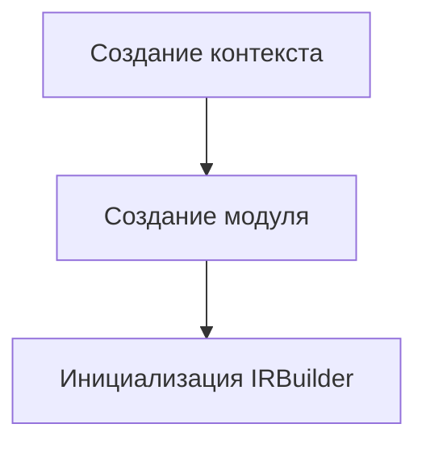
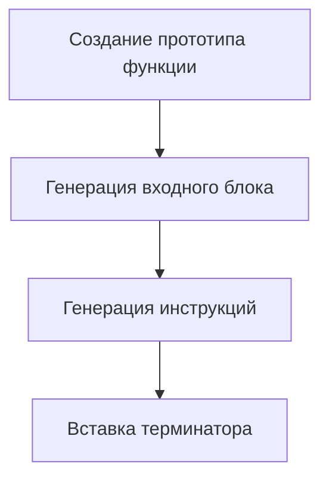
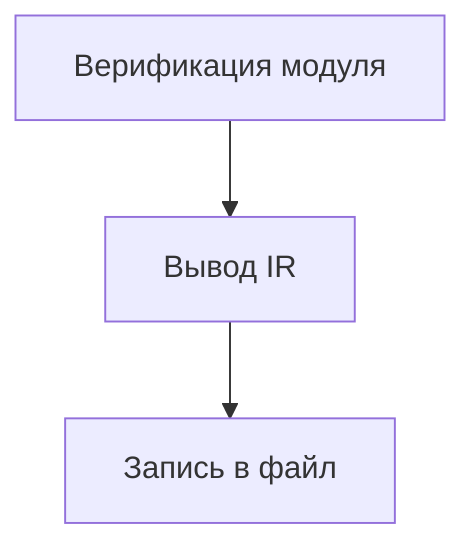

# Генератор LLVM-кода для MorningLang - Профессиональная документация

Исчерпывающее техническое руководство по реализации LLVM-бэкенда для языка MorningLang.  
Предназначено для инженеров компиляторов и C++-разработчиков, работающих с инфраструктурой LLVM.

---

## Оглавление
1. [Архитектурный обзор](#обзор)
2. [Анализ ключевых компонентов](#компоненты)
3. [Детальный разбор кода](#код)
4. [Глубокое погружение в LLVM](#llvm)
5. [Детали реализации на C++](#cpp)
6. [Пошаговый процесс компиляции](#процесс)

---

<a name="обзор"></a>
## 1. Архитектурный обзор 🏗️

Система реализует минимальный LLVM-бэкенд со следующим конвейером:

```
Исходный код → AST (будущая реализация) → Генерация IR → LLVM IR → Объектный код
```

Текущая реализация фокусируется на:
- Инициализации LLVM-контекста
- Инфраструктуре генерации IR
- Управлении модулями
- Конструкции базовых блоков

---

<a name="компоненты"></a>
## 2. Анализ ключевых компонентов 🔍

### 2.1 Структура класса

```cpp
class MorningLanguageLLVM {
    // Менеджер LLVM-контекста
    std::unique_ptr<llvm::LLVMContext> context;
    
    // Контейнер IR
    std::unique_ptr<llvm::Module> module;
    
    // Генератор инструкций
    std::unique_ptr<llvm::IRBuilder<>> irBuilder;
    
    // Текущая обрабатываемая функция
    llvm::Function* activeFunction;
};
```

### 2.2 Роли компонентов

| Компонент              | Класс LLVM            | Ответственность                  | Время жизни     |
|------------------------|-----------------------|-----------------------------------|-----------------|
| Менеджер контекста     | LLVMContext          | Уникальность типов/констант      | Весь процесс    |
| Контейнер IR           | Module               | Хранение функций/глобальных      | Компиляция      |
| Генератор инструкций   | IRBuilder<>          | Создание SSA-значений            | На уровне функции |
| Дескриптор функции     | Function             | Текущая единица генерации кода    | Генерация       |

---

<a name="код"></a>
## 3. Детальный разбор кода 💻

### 3.1 Инициализация модуля

```cpp
void initializeModule() {
    // 1. Создание изолированного контекста
    //    - Необходимо до создания любых LLVM-объектов
    //    - Предотвращает конфликты типов между модулями
    context = std::make_unique<llvm::LLVMContext>();
    
    // 2. Инициализация модуля компиляции
    //    - "MorningLangCompilationUnit" - имя модуля
    //    - *context - ссылка на владеющий контекст
    module = std::make_unique<llvm::Module>(
        "MorningLangCompilationUnit", 
        *context
    );
    
    // 3. Подготовка IR-билдера
    //    - Требует контекст для создания типов
    //    - Точка вставки устанавливается позже
    irBuilder = std::make_unique<llvm::IRBuilder<>>(*context);
}
```

### 3.2 Процесс создания функции

```cpp
llvm::Function* createFunction(const std::string& name,
                               llvm::FunctionType* type) {
    // Проверка существующих объявлений
    // - Модуль содержит таблицу символов функций
    if (auto* existing = module->getFunction(name))
        return existing;
    
    // Создание прототипа функции
    // - ExternalLinkage: Видимость между модулями
    // - verifyFunction: Валидация IR
    auto* func = llvm::Function::Create(
        type,
        llvm::Function::ExternalLinkage,
        name,
        module.get()
    );
    verifyFunction(*func);
    
    // Подготовка тела функции
    // - Создание входного блока
    // - Позиционирование билдера
    auto* entry = llvm::BasicBlock::Create(*context, "entry", func);
    irBuilder->SetInsertPoint(entry);
    
    return func;
}
```

### 3.3 Процесс генерации IR

```cpp
void generateIR() {
    // 1. Создание типа функции
    //    - getInt32Ty(): 32-битный целый тип
    //    - false: Функция без переменных аргументов
    auto* mainType = llvm::FunctionType::get(
        irBuilder->getInt32Ty(), 
        /* параметры */ {}, 
        /* isVarArg */ false
    );
    
    // 2. Объявление функции
    activeFunction = createFunction("main", mainType);
    
    // 3. Генерация значения
    //    - getInt32() создаёт ConstantInt
    //    - Неявное SSA-значение
    llvm::Value* result = irBuilder->getInt32(42);
    
    // 4. Терминаторная инструкция
    //    - Обязательна для завершения базового блока
    irBuilder->CreateRet(result);
}
```

---

<a name="llvm"></a>
## 4. Глубокое погружение в LLVM 🧠

### 4.1 LLVMContext

**Назначение**: Управление уникальностью типов/констант и изоляция потоков  
**Ключевые операции**:
```cpp
// Пример создания типа
llvm::Type* int32Ty = llvm::Type::getInt32Ty(*context);
```

### 4.2 IRBuilder

**Основные возможности**:
- Управление SSA-значениями
- Вставка инструкций
- Помощники преобразования типов

**Создание инструкций**:
```cpp
// Типичная арифметическая операция
llvm::Value* add = irBuilder->CreateAdd(
    irBuilder->getInt32(40),
    irBuilder->getInt32(2),
    "sum"
);
```

### 4.3 Module

**Структура**:
```llvm
; ModuleID = 'MorningLangCompilationUnit'
source_filename = "MorningLangCompilationUnit"

define i32 @main() {
entry:
  ret i32 42
}
```

---

<a name="cpp"></a>
## 5. Детали реализации на C++ ⚙️

### 5.1 Умные указатели

```cpp
std::unique_ptr<llvm::LLVMContext> context;
```
- **Владение**: Модель исключительного владения
- **Преимущества**:
  - Автоматическое освобождение ресурсов
  - Чёткая семантика владения
  - Безопасность при исключениях

### 5.2 Современная работа с типами

```cpp
auto* func = module->getFunction(name);
```
- **Использование auto**:
  - Безопасность типов с выводом компилятора
  - Сокращение многословия для сложных LLVM-типов

### 5.3 Валидация LLVM

```cpp
verifyFunction(*func);
```
- **Проверки**:
  - Целостность базовых блоков
  - Консистентность возвращаемых типов
  - Проверка типов параметров

---

<a name="процесс"></a>
## 6. Пошаговый процесс компиляции 🔄

### 6.1 Фаза 1: Инициализация


### 6.2 Фаза 2: Генерация IR


### 6.3 Фаза 3: Вывод


---

## Техническое приложение 📚

### Время жизни объектов LLVM

| Объект         | Точка создания         | Точка разрушения        |
|----------------|------------------------|-------------------------|
| LLVMContext    | initializeModule()     | Деструктор класса       |
| Module         | initializeModule()     | Деструктор класса       |
| Function       | createFunction()       | Уничтожение модуля      |
| BasicBlock     | createBasicBlock()     | Уничтожение функции     |

### Управление памятью

```cpp
// Пример исключительного владения
std::unique_ptr<llvm::Module> module;

// Сырые указатели для объектов LLVM
llvm::Function* func;  // Владелец - модуль
```

---

Данная документация сочетает инженерные практики разработки компиляторов на LLVM с современными техниками C++ для создания надёжной основы генерации кода.  
Для дополнительных вопросов обращайтесь к руководству программиста LLVM или в команду разработки компиляторов.
